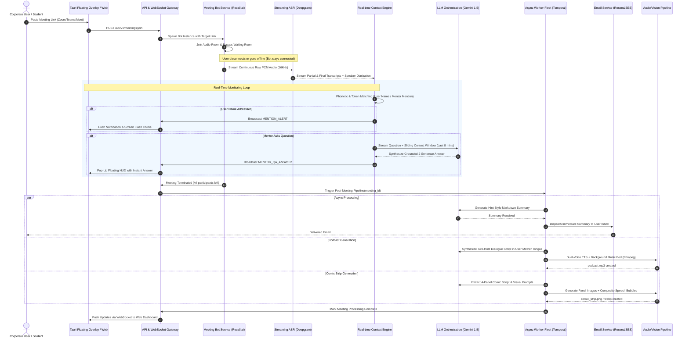
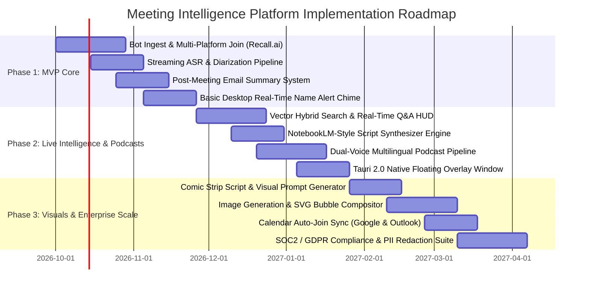

# MeetMee — AI Corporate Meeting Intelligence & Transformation Platform
**GitHub Repository**: [https://github.com/PR-ds/MeetMee.git](https://github.com/PR-ds/MeetMee.git)

## Executive Summary
This document outlines the end-to-end technical specification, system architecture, database schema, frontend UX considerations, phased roadmap, and cost-benefit analysis for **MeetMee**, an enterprise-grade AI Meeting Intelligence & Transformation Platform. 

**MeetMee** serves corporate employees, students, and academic staff by attending meetings autonomously, detecting critical real-time mentions and questions, delivering immediate hint-style summaries, and transforming passive transcripts into high-engagement artifacts (multilingual podcasts and visual comic strips).

---

## 1. High-Level System Architecture

MeetMee follows an **Event-Driven, Decoupled Microservices Architecture** designed to handle high-throughput real-time audio streams, low-latency live alerts, and compute-heavy asynchronous media generation.

```
                                  +---------------------------------------+
                                  |         User Interfaces               |
                                  | - Next.js 15 Web & PWA Dashboard      |
                                  | - Tauri 2.0 Desktop Floating Overlay  |
                                  +-------------------+-------------------+
                                                      |
                                     HTTPS / WSS      | Real-time Alerts / Q&A
                                                      v
+-----------------------+         +-------------------+-------------------+
|  Meeting Platforms    |         |   API Gateway & WebSocket Cluster    |
| (Zoom, Teams, Meet)   |         |   (Node.js / Fastify / Socket.io)     |
+-----------+-----------+         +---------+--------------------+--------+
            |                               |                    |
            | Bot Joins Session             | Auth / State Sync  | Event Dispatch
            v                               v                    v
+-----------+-----------+         +---------+---------+  +-------+--------+
| Headless Bot Fleet    | Stream  | Redis 7.2 Cluster |  | PostgreSQL 16  |
| (Recall.ai / Custom   | Raw PCM | (Pub/Sub & Cache) |  | + pgvector     |
| Chromium Instances)   +-------->+-------------------+  +----------------+
+-----------+-----------+                   |
            | Audio Buffer                  | Streaming Events
            v                               v
+-----------+-----------+         +---------+-----------------------------+
| Real-Time Ingestion   |         | Real-Time Event & RAG Engine          |
| Engine (Deepgram      +-------->| - Name & Mentor Mention Detector      |
| Nova-2 Streaming ASR) | Tokens  | - Context-Aware Pop-up Q&A Generator  |
+-----------------------+         +-------------------+-------------------+
                                                      |
                                                      | Real-Time WebSockets
                                                      v
                                          [User Floating Overlay]
                                                      
---------------------------------------------------------------------------
[POST-MEETING ASYNCHRONOUS PIPELINE (Celery / Temporal Worker Fleet)]
---------------------------------------------------------------------------

Full Transcript + Speaker Diarization
                  |
                  +-------------------------------------------------------+
                  |                                                       |
                  v                                                       v
+-----------------+-------------------+                 +-----------------+-------------------+
| Feature 3: Hint Summary Engine      |                 | Feature 5: Multilingual Podcast Gen |
| - Gemini 1.5 Pro Prompt Orchestrator|                 | - NotebookLM-Style Script Synthesizer|
| - Key Decisions & Action Items      |                 | - Multilingual Translation Engine   |
+-----------------+-------------------+                 | - Dual-Speaker TTS (ElevenLabs API) |
                  |                                     | - Music & Ambient Stem Mixer (FFmpeg)|
                  v                                     +-----------------+-------------------+
+-----------------+-------------------+                                   |
| Automated Email Delivery Service    |                                   v
| (Resend / AWS SES Transactional)    |                         +---------+-------------------+
+-------------------------------------+                         | Cloud Storage (S3 / R2)     |
                                                                | & Web Podcast Audio Player  |
                  +---------------------------------------------+-----------------------------+
                  |
                  v
+-----------------+-------------------+
| Feature 6: Visual Comic Generator   |
| - Scene & Dialogue Beat Extractor   |
| - Character & Panel Prompt Gen      |
| - FLUX.1 / SDXL Image Pipeline      |
| - SVG / Canvas Comic Compositor     |
+-----------------+-------------------+
                  |
                  v
        [Visual Comic Viewer]
```

### 1.1 End-to-End Data Flow Sequence



---

## 2. Detailed Feature Breakdown

### Feature 1: Autonomous AI Meeting Attendance & Transcription

#### Objective & Architecture
The system enables users to paste a Zoom, Microsoft Teams, or Google Meet URL. An autonomous bot joins the call as a virtual participant, records multi-channel audio, and pipes it to real-time speech-to-text engines. The bot operates on dedicated server infrastructure; **if the user drops connection, closes their laptop, or loses Wi-Fi, the bot continues recording and transcribing unabated**.

```
[User Pastes URL]
       |
       v
[FastAPI / NestJS Bot Dispatcher]
       |
       v
[Recall.ai API / Self-Hosted Headless Chromium Pool]
       |
       +---> [WebRTC Audio Tap] ---> [Opus to Linear PCM 16kHz]
                                                |
                                                v
                                 [WebSocket Stream to Deepgram Nova-2]
                                                |
                                                v
                                 [Diarized Chunks to Postgres & Redis]
```

#### Technical Dependencies & Integrations
- **Bot Engine**: Primary: [Recall.ai](https://www.recall.ai) (Universal Unified Meeting Bot API for Zoom, Teams, Meet). Fallback: Custom Dockerized Headless Chromium instances running Playwright with virtual ALSA audio loopbacks (`snd-aloop`) streaming to GStreamer.
- **ASR & Diarization**: Deepgram Nova-2 Streaming API (`model=nova-2-meeting`, `punctuate=true`, `diarize=true`, `smart_format=true`, `language=multi`).
- **Data Ingest Format**: Raw 16kHz 16-bit Mono Linear PCM or Opus stream.

#### Resilience & Offline Sync Strategy
- Bot session is decoupled from user client state. The meeting state is tracked in PostgreSQL with `status: IN_CALL`.
- Audio streams are duplicated:
  1. **Hot Stream**: Sharded to Deepgram WebSocket for immediate text generation.
  2. **Cold Stream**: Raw Opus chunks flushed every 10 seconds to an S3/R2 bucket (`s3://meetings-raw-audio/{meeting_id}/{chunk_id}.opus`).
- If Deepgram or network connectivity blips, the raw audio chunk is re-queued for asynchronous offline transcription using OpenAI Whisper Large-v3 Turbo.

---

### Feature 2: Real-Time Name & Mentor Mention Notification

#### Objective & Architecture
Detect when the user is directly addressed by a host, teacher, manager, or mentor (e.g., *"Alex, what is the status of the sprint?"* or *"Alex, can you take the next slide?"*), triggering immediate, non-intrusive notifications across active devices.

```
Streaming Diarized Tokens (Deepgram)
                 |
                 v
   +-------------+-------------+
   | Sliding Window Buffer     |  (Last 15 seconds of speech)
   +-------------+-------------+
                 |
         Parallel Evaluation
         +-------+-------+
         |               |
         v               v
  [Phonetic Match]  [LLM Direct-Address Classifier]
  (Double Metaphone/ (Gemini 1.5 Flash / Groq Llama 3-8B)
   Fuzzy Levenshtein) "Is user being asked to speak?"
         |               |
         +-------+-------+
                 |
                 v
        Confidence Score > 0.85
                 |
                 v
   [Redis Pub/Sub -> WSS Gateway]
                 |
                 +---> Sound Chime (Soft 440Hz dual-tone)
                 +---> Screen Border Flash (CSS pulse animation)
                 +---> System Tray / Desktop Push Notification
```

#### Technical Dependencies & Configuration
- **Phonetic Matching**: Python `jellyfish` (Double Metaphone + Levenshtein distance $\le 1$ to catch misheard or accented names).
- **User Alias Profiling**: User profile stores full name, preferred nicknames, phonetic spellings, and assigned mentor/host names.
- **Fast Classification Layer**: Sub-300ms evaluation via Groq (Llama-3.1-8B-Instant) or Gemini 1.5 Flash using structured outputs (`{"addressed": true, "urgency": "high", "quote": "..."}`).

---

### Feature 3: Post-Meeting Summary & Instant Email Distribution

#### Objective & Architecture
Deliver clean, scannable, **hint-style notes** to the user's inbox within 60 seconds of meeting termination. Hint-style notes focus on core ideas, unresolved blockers, and specific action items rather than verbose verbatim transcripts.

#### Note Structure Template
- **🎯 60-Second TL;DR**: 3 high-impact bullet points.
- **💡 Hint-Style Concept Anchors**: Key technical or strategic topics mapped to 1-line mnemonics.
- **📋 Action Items & Ownership**: Matrix of `[Task | Assignee | Deadline | Context Timestamp]`.
- **❓ Unresolved Decisions**: Open questions requiring follow-up.

#### Technical Dependencies & Flow
- **LLM Pipeline**: Google Gemini 1.5 Pro (leveraging native 2M context window to ingest full 2-3 hour raw transcripts without chunk fragmentation).
- **Email Service**: Resend API or AWS SES with React Email (`@react-email/components`) for responsive, clean HTML templates with dark-mode support.
- **Worker Queue**: Temporal.io or Celery orchestrated task triggered on the `meeting.ended` webhook from Recall.ai.

---

### Feature 4: Context-Aware Live Q&A Window

#### Objective & Architecture
When a mentor or speaker asks a question during the meeting, the system detects the question, searches the meeting's prior context, and presents a concise, suggested answer in a floating desktop HUD.

```
1. Live Audio: "Alex, what was the latency benchmark we agreed on earlier?"
       |
       v
2. Question Detector (Regex + Gemini Flash) -> Detects question directed at user
       |
       v
3. Hybrid Search:
   - Dense: Vector embedding of question query (OpenAI text-embedding-3-small or Gemini text-embedding-004)
     against pgvector chunks of the current meeting transcript.
   - Sparse: BM25 keyword matching for exact numerical values/terms ("latency", "benchmark").
       |
       v
4. RAG Generation Prompt (Gemini 1.5 Flash, temperature 0.1):
   Context: Transcript snippets from minute 12 to 14.
   Task: Answer the mentor's question concisely in under 20 words with timestamp citation.
       |
       v
5. Streaming Response pushed to Tauri Desktop Overlay:
   "Suggested Answer: 120ms p95 latency. (Discussed at 14:15 by Sarah)"
   [Copy Answer] [Dismiss]
```

#### Edge Cases & Mitigations
- **Hallucination Prevention**: If cosine similarity between the question and meeting context chunks is below $0.72$, the system outputs: *"Topic not found in earlier meeting transcript. Listening for external context..."* instead of fabricating an answer.
- **Latency Threshold**: Total roundtrip from speech completion to UI display must be $< 1.8$ seconds. Uses streaming ASR + streaming LLM tokens directly to the WebSocket.

---

### Feature 5: Multilingual Podcast Generation (NotebookLM-Style)

#### Objective & Architecture
Transform dry transcripts into a studio-grade, **two-host conversational audio podcast** (Host A: curious clarifier, Host B: deep domain expert) translated into the user's selected **mother tongue** (e.g., Spanish, Hindi, French, Mandarin, German, etc.).

```
[Full Diarized Transcript]
           |
           v
[LLM Dialogue Synthesizer (Gemini 1.5 Pro)]
Script Generator: 2-person banter, jokes, natural pauses, analogies
Target Language: Configurable (User's Mother Tongue)
           |
           v
[Structured Dialogue JSON]
[
  {"speaker": "Host_A", "text": "Bienvenue! Alors, qu'est-ce qu'on retient du meeting ce matin?"},
  {"speaker": "Host_B", "text": "Salut Marc. Le gros point, c'était le passage à la nouvelle infra..."}
]
           |
           +-----------------------------+
           |                             |
           v                             v
[ElevenLabs Conversational API /   [MusicGen / AudioCraft Stem]
 Google Cloud Journey Voices]      Generates 8-bar ambient intro/outro
 Stream Dual-Voice Audio Buffers         |
           |                             |
           +--------------+--------------+
                          |
                          v
            [FFmpeg Audio Compositor]
            - Cross-fade intro music at -18dB under speech
            - Dynamic range compression & normalization (-14 LUFS)
            - Stitch speech turns with 250ms natural conversational pause
                          |
                          v
            [Final Output: podcast.mp3 -> Cloudflare R2]
```

#### Audio Production Tech
- **Script Generation**: Gemini 1.5 Pro with custom prompt engineering replicating the NotebookLM "Deep Dive" two-host dynamic (includes breathing tags, interruptions, natural discourse markers like *"umm"*, *"you know"*, or translated equivalents).
- **TTS Engine**: ElevenLabs Multilingual v2 API (`turbo_v2.5` or `multilingual_v2`) using two fixed distinct voice IDs (e.g., Male Host: "Adam", Female Host: "Rachel") with multilingual phonetic accuracy.
- **Audio Mixing**: Headless `ffmpeg` node worker:
  - Generates intro/outro music beds using Meta's `MusicGen` small model or a curated royalty-free corporate/chill lofi library.
  - Applies loudness normalization (`loudnorm=I=-14:LRA=11:TP=-1.5`).

---

### Feature 6: Visual Comic Strip / Graphical Summary Generation

#### Objective & Architecture
Convert the key narrative arc of the meeting into an engaging **4-to-6 panel comic strip**. This boosts retention for students and visual learners, transforming technical discussions into visual metaphors.

```
Full Transcript
      |
      v
[Comic Script Extractor (LLM)]
Deconstructs meeting into 4 distinct beats:
- Panel 1: The Inciting Conflict / Goal (e.g., Server crashes or Project deadline)
- Panel 2: The Heated Debate / Brainstorming
- Panel 3: The Breakthrough / Decision
- Panel 4: The Path Forward / Final Action Items
      |
      v
[Visual Prompt Engine]
Generates style-consistent image generation prompts:
"Clean vector modern comic art style, flat colors, clear linework, character: developer with glasses..."
      |
      v
[Parallel Image Gen: FLUX.1 [Schnell] / Replicate API]
Renders 4 panel backgrounds
      |
      v
[Canvas / SVG Compositor (Node.js Sharp + Canvas)]
- Draws comic grid borders
- Generates speech bubbles with calculated tail pointers towards characters
- Insets dialogue text with typography formatting
      |
      v
[Final Comic Strip: PNG / WebP & Interactive SVG Modal]
```

---

## 3. Database Schema Considerations

We utilize **PostgreSQL 16** with the **`pgvector`** extension for unified relational state and high-speed vector similarity search.

```sql
-- Enable necessary extensions
CREATE EXTENSION IF NOT EXISTS "uuid-ossp";
CREATE EXTENSION IF NOT EXISTS "vector";

-- Enum types
CREATE TYPE user_role AS ENUM ('student', 'corporate_employee', 'staff', 'admin');
CREATE TYPE meeting_status AS ENUM ('scheduled', 'bot_joining', 'in_progress', 'completed', 'failed');
CREATE TYPE platform_type AS ENUM ('zoom', 'google_meet', 'ms_teams', 'webex');
CREATE TYPE event_type AS ENUM ('name_mention', 'mentor_question', 'action_item', 'topic_shift');

-- Users & Profiles
CREATE TABLE users (
    id UUID PRIMARY KEY DEFAULT uuid_generate_v4(),
    email VARCHAR(255) UNIQUE NOT NULL,
    full_name VARCHAR(255) NOT NULL,
    phonetic_aliases TEXT[] DEFAULT '{}', -- e.g. ['Aleks', 'Alyx', 'Alexander']
    mother_tongue VARCHAR(10) DEFAULT 'en', -- ISO 639-1 code (e.g., 'es', 'hi', 'fr')
    role user_role DEFAULT 'corporate_employee',
    created_at TIMESTAMPTZ DEFAULT CURRENT_TIMESTAMP,
    updated_at TIMESTAMPTZ DEFAULT CURRENT_TIMESTAMP
);

-- User Notification & Content Preferences
CREATE TABLE user_preferences (
    user_id UUID PRIMARY KEY REFERENCES users(id) ON DELETE CASCADE,
    mentor_names TEXT[] DEFAULT '{}', -- names to actively listen for
    enable_chime_alert BOOLEAN DEFAULT TRUE,
    enable_screen_flash BOOLEAN DEFAULT TRUE,
    enable_qa_popup BOOLEAN DEFAULT TRUE,
    podcast_voice_pair VARCHAR(50) DEFAULT 'en_conversational_duo_1',
    comic_art_style VARCHAR(50) DEFAULT 'flat_vector_comic',
    email_summary_enabled BOOLEAN DEFAULT TRUE
);

-- Meetings Table
CREATE TABLE meetings (
    id UUID PRIMARY KEY DEFAULT uuid_generate_v4(),
    user_id UUID NOT NULL REFERENCES users(id) ON DELETE CASCADE,
    title VARCHAR(500) DEFAULT 'Untitled Meeting',
    platform platform_type NOT NULL,
    meeting_url TEXT NOT NULL,
    bot_session_id VARCHAR(255), -- External bot instance reference (Recall.ai)
    status meeting_status DEFAULT 'scheduled',
    scheduled_start TIMESTAMPTZ,
    actual_start TIMESTAMPTZ,
    actual_end TIMESTAMPTZ,
    raw_audio_url TEXT,
    created_at TIMESTAMPTZ DEFAULT CURRENT_TIMESTAMP
);

-- Participants Identified in Meeting
CREATE TABLE meeting_participants (
    id UUID PRIMARY KEY DEFAULT uuid_generate_v4(),
    meeting_id UUID NOT NULL REFERENCES meetings(id) ON DELETE CASCADE,
    speaker_index INT NOT NULL, -- Speaker 0, Speaker 1 from ASR
    display_name VARCHAR(255),
    is_mentor BOOLEAN DEFAULT FALSE,
    is_user BOOLEAN DEFAULT FALSE,
    created_at TIMESTAMPTZ DEFAULT CURRENT_TIMESTAMP
);

-- Raw Diarized Transcript Segments
CREATE TABLE transcript_segments (
    id UUID PRIMARY KEY DEFAULT uuid_generate_v4(),
    meeting_id UUID NOT NULL REFERENCES meetings(id) ON DELETE CASCADE,
    speaker_index INT NOT NULL,
    speaker_name VARCHAR(255),
    text TEXT NOT NULL,
    start_time_ms INT NOT NULL,
    end_time_ms INT NOT NULL,
    confidence NUMERIC(4, 3),
    created_at TIMESTAMPTZ DEFAULT CURRENT_TIMESTAMP
);

-- Vectorized Chunks for Real-Time Q&A & Search
CREATE TABLE transcript_chunks (
    id UUID PRIMARY KEY DEFAULT uuid_generate_v4(),
    meeting_id UUID NOT NULL REFERENCES meetings(id) ON DELETE CASCADE,
    chunk_index INT NOT NULL,
    text TEXT NOT NULL,
    start_time_ms INT NOT NULL,
    end_time_ms INT NOT NULL,
    embedding vector(1536), -- Compatible with text-embedding-3-small or Gemini embeddings
    created_at TIMESTAMPTZ DEFAULT CURRENT_TIMESTAMP
);

-- Real-Time Events (Mentions, Questions, Answers)
CREATE TABLE realtime_events (
    id UUID PRIMARY KEY DEFAULT uuid_generate_v4(),
    meeting_id UUID NOT NULL REFERENCES meetings(id) ON DELETE CASCADE,
    event_type event_type NOT NULL,
    trigger_text TEXT NOT NULL,
    speaker_name VARCHAR(255),
    timestamp_ms INT NOT NULL,
    suggested_response TEXT,
    was_displayed BOOLEAN DEFAULT TRUE,
    user_feedback_score INT, -- 1 for helpful, -1 for unhelpful
    created_at TIMESTAMPTZ DEFAULT CURRENT_TIMESTAMP
);

-- Post-Meeting Summaries
CREATE TABLE meeting_summaries (
    id UUID PRIMARY KEY DEFAULT uuid_generate_v4(),
    meeting_id UUID UNIQUE NOT NULL REFERENCES meetings(id) ON DELETE CASCADE,
    tldr TEXT[] NOT NULL,
    hint_notes JSONB NOT NULL, -- Structured concept anchors
    action_items JSONB NOT NULL, -- [{task, owner, deadline}]
    email_sent_at TIMESTAMPTZ,
    created_at TIMESTAMPTZ DEFAULT CURRENT_TIMESTAMP
);

-- Generated Podcasts
CREATE TABLE meeting_podcasts (
    id UUID PRIMARY KEY DEFAULT uuid_generate_v4(),
    meeting_id UUID NOT NULL REFERENCES meetings(id) ON DELETE CASCADE,
    language_code VARCHAR(10) NOT NULL,
    dialogue_script JSONB NOT NULL, -- [{"speaker": "A", "line": "..."}]
    audio_file_url TEXT NOT NULL,
    duration_seconds INT NOT NULL,
    created_at TIMESTAMPTZ DEFAULT CURRENT_TIMESTAMP
);

-- Generated Visual Comics
CREATE TABLE meeting_comics (
    id UUID PRIMARY KEY DEFAULT uuid_generate_v4(),
    meeting_id UUID NOT NULL REFERENCES meetings(id) ON DELETE CASCADE,
    panel_count INT DEFAULT 4,
    panels_metadata JSONB NOT NULL, -- [{"panel_num": 1, "caption": "...", "dialogue": "..."}]
    image_url TEXT NOT NULL,
    created_at TIMESTAMPTZ DEFAULT CURRENT_TIMESTAMP
);

-- Indexing for Sub-Second Query Performance
CREATE INDEX idx_meetings_user_status ON meetings(user_id, status);
CREATE INDEX idx_transcript_segments_meeting ON transcript_segments(meeting_id, start_time_ms);
CREATE INDEX idx_realtime_events_meeting ON realtime_events(meeting_id, timestamp_ms);
CREATE INDEX idx_transcript_chunks_hnsw ON transcript_chunks USING hnsw (embedding vector_cosine_ops)
    WITH (m = 16, ef_construction = 64);
```

---

## 4. Frontend & UX Considerations

### 4.1 Hybrid Desktop & Web Architecture
To deliver instant pop-ups that float above Zoom, Microsoft Teams, and Google Meet without requiring browser window focus, the frontend consists of two tightly coupled applications:
1. **Desktop Floating Companion App (Tauri 2.0 / Rust + React)**:
   - Extremely lightweight ($< 35\text{ MB}$ memory footprint vs Electron's $250\text{ MB}$).
   - Native OS-level borderless, transparent, *Always-on-Top* window (`set_always_on_top(true)`).
   - Global hotkeys (e.g., `Cmd/Ctrl + Shift + A` to copy the latest suggested answer).
2. **Web / PWA Application (Next.js 15 + Tailwind CSS + Shadcn UI)**:
   - Meeting library, transcript browser, interactive audio podcast player, and comic viewer.

### 4.2 Non-Intrusive, High-Visibility UI/UX Components

#### The Real-Time Pop-Up Q&A HUD
```
+-------------------------------------------------------------+
| 🟢 MeetMee HUD: Q3 Planning Review          [ 14:22 ] [ X ]  |
+-------------------------------------------------------------+
| ⚠️ MENTOR QUESTION DETECTED (Prof. Harrison)                 |
| "Alex, what latency target was agreed on in the demo?"      |
+-------------------------------------------------------------+
| 💡 SUGGESTED ANSWER (94% confidence)                        |
| • 120ms p95 latency on the streaming pipeline.              |
| • Mentioned by Sarah at 08:45 during Architecture review.   |
+-------------------------------------------------------------+
| [ 📋 Copy Answer (Ctrl+C) ]          [ ✕ Dismiss (Esc) ]    |
+-------------------------------------------------------------+
```

#### Attention-Grabbing Notification Mechanics:
- **Audio Chime**: Subtly spatialized, non-jarring chime (sine-wave harmonic at 528Hz) played through user headphones only (not broadcasted to the meeting mic).
- **Visual Perimeter Glow**: The floating HUD pulses with an amber/blue border animation (`animate-pulse`) for 3 seconds to catch peripheral vision without obscuring screen content.

### 4.3 Content Consumption Hub
- **Interactive Podcast Player**: Visualized audio waveform (`wavesurfer.js`) synchronized with bilingual transcript lyrics (clicking a line in the script seeks the podcast directly).
- **Comic Strip Carousel**: Horizontal masonry layout with zoom-on-click modals, panel-by-panel walkthrough mode, and instant "Export to PDF/Slack" button.

---

## 5. Recommended Technology Stack

| Layer | Recommended Choice | Rationale & Trade-Offs |
|---|---|---|
| **Frontend Web** | **Next.js 15 (App Router, React 19)** | Server-side rendering for dashboard, high-speed static generation for meeting notes, full TypeScript ecosystem. |
| **Desktop Companion** | **Tauri 2.0 (Rust + React)** | 10x lighter memory footprint than Electron; native OS always-on-top windowing and global keyboard hooks. |
| **Backend API Gateway** | **Fastify (Node.js/TypeScript)** | High concurrent WebSocket handling ($30\text{k}+$ conn/node), minimal overhead for JSON schema validation. |
| **AI & Worker Engine** | **Python 3.12 (FastAPI + Temporal.io)** | Robust ecosystem for audio manipulation (NumPy/FFmpeg) and stateful workflow management for long-running pipelines. |
| **Meeting Bot Infra** | **Recall.ai** | Eliminates maintaining thousands of brittle headless browser instances across Zoom, Meet, and Teams platform updates. |
| **Streaming ASR** | **Deepgram Nova-2** | Sub-300ms time-to-first-token, superior multi-speaker diarization accuracy, integrated entity formatting. |
| **LLM Orchestration** | **Google Gemini 1.5 Pro / Flash** | Native multi-modal context (2M tokens for full meeting ingest), unmatched multi-language translation and conversational tone. |
| **TTS & Podcast Audio** | **ElevenLabs API + FFmpeg** | Most natural conversational pacing, breathing, and multi-lingual voice synthesis; FFmpeg handles audio stems. |
| **Visual Comic Engine** | **FLUX.1 [Schnell] via Fal.ai / Replicate** | Sub-second high-fidelity stylistic image generation with prompt consistency; composited via Node `Sharp`. |
| **Database & Vector** | **PostgreSQL 16 + pgvector** | Unified relational and vector database; eliminates synchronizing external vector DBs with relational metadata. |
| **Cache & Pub/Sub** | **Redis 7.2 (ElastiCache / Upstash)** | Ephemeral streaming token transport, distributed locks, session state for active meetings. |
| **Object Storage** | **Cloudflare R2** | S3-compatible API with **$0 egress fees**, critical for heavy streaming audio, podcast MP3s, and comic image assets. |

---

## 6. Key Risks, Dependencies, and Mitigation Strategies

```
+------------------------------------+------------------------------------+-----------------------------------------+
| Risk Factor                        | Impact                             | Concrete Mitigation Strategy            |
+------------------------------------+------------------------------------+-----------------------------------------+
| Meeting Platform Bot Blocks        | High: Bot kicked or denied entry   | • Enterprise OAuth App integration.     |
| (Zoom / Teams updates)             | by meeting waiting room.           | • Display human-like bot names          |
|                                    |                                    |   ("Alex's Notetaker (AI)").            |
|                                    |                                    | • Fallback to local desktop audio loop  |
|                                    |                                    |   via virtual audio cable if rejected.  |
+------------------------------------+------------------------------------+-----------------------------------------+
| Latency in Real-time Q&A           | High: Mentor asks question; answer | • Dual-engine architecture: Fast Groq/  |
|                                    | arrives 10 seconds too late.       |   Gemini Flash for live Q&A (<1.5s);    |
|                                    |                                    |   Gemini 1.5 Pro reserved for summaries.|
|                                    |                                    | • Sliding-window vector index cached    |
|                                    |                                    |   in Redis RAM rather than disk lookups.|
+------------------------------------+------------------------------------+-----------------------------------------+
| Hallucination in Q&A Output        | Critical: User states incorrect    | • Strict RAG confidence threshold (>0.75)|
|                                    | facts to supervisor or mentor.     | • Include exact timestamp citations.    |
|                                    |                                    | • If context missing, explicitly reply: |
|                                    |                                    |   "Not covered in today's discussion."  |
+------------------------------------+------------------------------------+-----------------------------------------+
| Third-Party API Outages            | Medium: Summaries or podcasts fail | • Decoupled Temporal workflows with     |
| (ElevenLabs, Deepgram, LLMs)       | to generate post-meeting.          |   exponential backoff and automatic     |
|                                    |                                    |   failover (e.g., Deepgram -> Whisper;  |
|                                    |                                    |   ElevenLabs -> Google Cloud TTS).      |
+------------------------------------+------------------------------------+-----------------------------------------+
| Privacy, GDPR & Consent            | Legal: Unauthorized recording of   | • Auto-announce in chat: "This session  |
| Liabilities                        | participants without consent.      |   is recorded by [User] via AI Bot".    |
|                                    |                                    | • Automatic PII redaction layer.        |
|                                    |                                    | • 30-day auto-purge policy for raw audio|
+------------------------------------+------------------------------------+-----------------------------------------+
```

---

## 7. Phased Implementation Roadmap



### Phase 1: MVP Foundation (Weeks 1 – 8)
- **Deliverables**:
  - Web dashboard to paste Zoom/Teams/Meet link.
  - Recall.ai bot join integration with audio recording.
  - Deepgram streaming transcription and basic speaker diarization.
  - Automated post-meeting hint-style email summary via Resend.
  - Basic phonetic name mention detection pushing web notifications.
- **Milestone Exit Gate**: User can paste a link, close their laptop, and receive an accurate hint-style summary email within 2 minutes of meeting end.

### Phase 2: Real-Time Intelligence & Audio Podcasting (Weeks 9 – 16)
- **Deliverables**:
  - Context-Aware Q&A engine with sub-2-second answers to mentor questions.
  - Tauri 2.0 cross-platform floating desktop companion HUD.
  - NotebookLM-style 2-host conversational script generator.
  - ElevenLabs multilingual TTS synthesis + FFmpeg background music bed in user's mother tongue.
- **Milestone Exit Gate**: Real-time Q&A answers displayed accurately during a live simulated corporate meeting; podcast generated and playable in Spanish, Hindi, or French.

### Phase 3: Visual Storytelling & Enterprise Scale (Weeks 17 – 24)
- **Deliverables**:
  - 4-panel visual comic strip generation pipeline with FLUX.1 + automated speech bubble compositor.
  - Google Calendar and Microsoft Outlook auto-join sync.
  - Full offline-first PWA caching for mobile transcript/podcast playback.
  - Enterprise GDPR compliance suite (PII scrubbing, custom retention policies).
- **Milestone Exit Gate**: Production-ready platform operating reliably across 500 concurrent meeting streams.

---

## 8. Scalability, Privacy & Cost Estimation

### 8.1 Scalability & Offline-First Design
- **Bot Cluster Elasticity**: Bot instances are isolated containers. When utilizing Recall.ai, capacity auto-scales across AWS regions without managing WebRTC peer connection limits.
- **Client Offline Resilience**:
  - Web app utilizes **Service Workers + IndexedDB** to cache meeting summaries, audio podcasts, and comic strips locally.
  - If a user loses internet during a meeting, the server-side bot continues recording uninterrupted. Once client reconnects, the WebSocket immediately syncs missed events and updates the state.

### 8.2 Privacy, Security & Compliance
1. **Consent Compliance**:
   - The bot displays a clear visual name: `MeetMee AI Assistant ([User Name])`.
   - On joining, the bot automatically posts a message in the meeting chat: *"Hello! I am MeetMee AI, recording this session on behalf of [User] to generate meeting notes and real-time assistance. If anyone objects, please type /stop."*
2. **Data Retention & Encryption**:
   - **At Rest**: AES-256 encryption on all S3 audio buckets and PostgreSQL databases.
   - **In Transit**: TLS 1.3 for all HTTPS/WSS communication.
   - **Retention Rules**: Raw audio files are permanently purged after 14 days by default; vector embeddings and summaries are retained indefinitely unless deleted by user.
   - **PII Scrubbing**: Presidio analyzer runs over transcripts to mask credit cards, social security numbers, and sensitive API keys before sending to LLMs.

### 8.3 Detailed Cost Estimation (Per Meeting Hour & Scale)

#### Unit Economics (Per 1-Hour Meeting):
| Component | Provider / Service | Calculation | Cost / Hour |
|---|---|---|---|
| **Bot Ingestion** | Recall.ai | \$0.50 per recorded hour | \$0.500 |
| **Streaming ASR** | Deepgram Nova-2 | \$0.0043 / min (\$0.258 / hr) | \$0.258 |
| **Real-time Q&A LLM** | Gemini 1.5 Flash | ~15 question scans + context chunks (~50k tokens) | \$0.008 |
| **Hint-Style Summary** | Gemini 1.5 Pro | 1-hour transcript (~12k words / 16k tokens) | \$0.025 |
| **Email Delivery** | Resend / SES | 1 email dispatch | \$0.001 |
| **Podcast Generation** | ElevenLabs Multilingual | ~1,200 words script (~6,000 characters @ \$0.03/1k chars) | \$0.180 |
| **Comic Strip Gen** | Fal.ai (FLUX Schnell) | 4 panels @ \$0.003 / image | \$0.012 |
| **Audio/Image Storage** | Cloudflare R2 | Storage + Zero Egress | \$0.003 |
| **Total Cost / Meeting**| | **Complete Pipeline (All 6 Features)** | **\$0.987** |

*Note: For users opting only for summaries and real-time alerts without audio podcasts or comics, the cost per meeting hour drops to **\$0.79**.*

#### Operational Scale Projections:
- **1,000 Monthly Meeting Hours**: $\approx \$987 / \text{month}$ infrastructure & API cost.
- **10,000 Monthly Meeting Hours**: $\approx \$8,200 / \text{month}$ (accounting for tier volume discounts on Deepgram and Recall.ai).

### 8.4 Commercial Subscription Model & Pricing Tiers

MeetMee provides a multi-tiered commercial model configured as follows:

| Plan | Pricing | Meeting Allocation | Feature Set & Access Control |
|---|---|---|---|
| **Free Tier** | **₹0** | **3 Meetings Total** | • Autonomous Bot Attendance & Transcription<br>• Real-Time Mentor Q&A Pop-up HUD<br>• Post-Meeting Hint-Style Email Delivery<br>• Monthly History Auto-Purge (30-day lifecycle)<br>🔒 *Comics & Podcasts Locked* |
| **Monthly Plan** | **₹99 / month** | **Up to 100 Meetings / month** | • Everything in Free Tier<br>• **✅ 4-Panel Visual Comic Strip Generator UNLOCKED**<br>• Monthly History Management with Permanent Save, Rename, Delete<br>• Always-Online Virtual Cloud Presence Daemon<br>🔒 *Podcasts Locked* |
| **Yearly Plan** | **₹1,099 / year** | **Unlimited Meetings** | • Everything in Monthly Plan<br>• **✅ Unlimited Meeting Hours**<br>• **✅ NotebookLM Multilingual Podcast Engine UNLOCKED**<br>• **🌟 EXCLUSIVE FEATURE: Native Language Voice Assistant for General Use** (Hindi, Tamil, Telugu, Spanish, French, English)<br>• Always-Online Virtual Cloud Presence Daemon<br>• Dedicated Priority GPU Processing |

